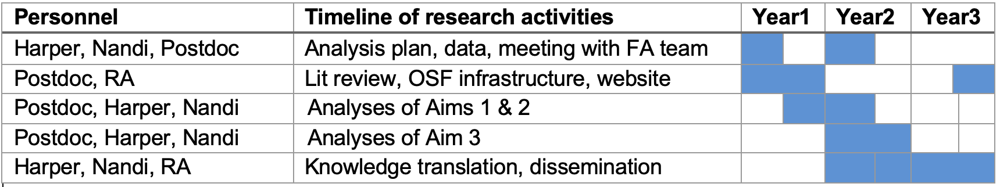

# Project Description

## Objectives

The overall aim of this project is to investigate how the peer review process may affect reliability and fairness in the distribution of scores and funding success of CIHR Project Grant applications.

## Specific Aims

1. To evaluate how reviewer expertise and engagement affects the impact of grant panel discussion on application scores.

2. To assess whether the effects of reviewer expertise and engagement differ by applicant characteristics such as gender or career stage.

3. To evaluate potential alternative schemes such as differential weighting of scores or partial randomization to determine funding for qualified applications.

## Background and Rationale

*Peer Review Model for Grants.* CIHR's Project Grant Program annually invests hundreds of millions of dollars in proposals to fund the "best ideas" and advance the health of Canadians [@governmentofcanada2016]. Prioritizing research through funding comes from both strategic investments and an evaluation of competitive applications by Peer Review Committees (PRCs). PRCs covering over 50 basic and applied research domains are composed of roughly 20-30 members identified and assigned based on having sufficient expertise and experience to evaluate, rate, and discuss applications [@governmentofcanada2016a].

Grant review panels using PRCs are common in many agencies and countries [@azoulay2020; @guthrie2018; @thorngate2011]. The rationale for using panels is that committees encompass a diverse range of perspectives and overlapping expertise that can correct misunderstandings among panel members, clarify ambiguities in scoring justifications, and converge on a more calibrated assessment [@azoulay2020]. However, committees may also suffer from a range of potential biases that affect group decision making, such as groupthink, conformity, free riding, polarization, or the influence of asymmetric information [@thorngate2011]. Such biases may be exacerbated when reviewers and non-reviewers of applications have access to different information.

A key challenge in grant panel review is human resource limitations [@azoulay2020]. PRCs receive many submissions, so each application is only evaluated by 3 reviewers who thoroughly read each application and identify its strengths and weaknesses with respect to the main adjudication criteria (significance, approaches and methods, expertise and resources). Based on the initial reviewer scores, the bottom-scoring 60% of applications are streamlined, with the remaining applications discussed by the panel. In the meeting the 3 reviewers of each application provide their initial scores (on a scale from 0 [poor] to 4.9 [outstanding]), and summarize the application's strengths and weaknesses, followed by panel discussion to arrive at a consensus score among the three reviewers. Each panel member then provides a final score (0 to 4.9) that must be within +/- 0.5 of the consensus score. The average of these scores, with equal weight given to all panel members, are used as inputs to the final decisions regarding funding.

The discretion of panel members to deviate from the consensus score could have meaningful consequences for the final score and ranking of applications [@banal-estanol2023; @olbrecht2010; @tamblyn2023]. Panel members' scores may be influenced by reviewer characteristics such as expertise regarding the application, level of engagement (reviewer or non-reviewer), gender, and prior reviewing experience. Such influences may also vary by characteristics of the applicant (gender, career stage). These factors may be particularly influential for panel members who *do not review* the application and must rely on panel discussion to form their final scores. Thus, in panels where only a few members have read the application, uneven access to information may lead to less-than-fair judgements (e.g., an influence of non-experts on final scores). The dynamics of group interactions, pressure to conform, and the subjective nature of discussions may all play critical roles in shaping which grants ultimately receive funding [@azoulay2020; @thorngate2011; @olbrecht2010]. These challenges may also be affected by virtual rather than face-to-face panel discussions [@gallo2013; @carpenter2015].

*Prior Literature*. Most prior research on grant peer review has focused on reviewer reliability [@guthrie2018]. Several studies suggest that inter-rater reliabilities for applications are moderate or low [@thorngate2011; @tamblyn2018; @erosheva2020; @pier2018; @mutz2012; @cole1981; @pier2017], vary across committee domains [@tamblyn2018], and require many reviewers to be consistent [@mayo2006; @kaplan2008]. However, low reliability is not necessarily inconsistent with identifying quality applications and can reflect a healthy diversity of opinions, expertise, or value judgements about research quality [@bailar1991; @derrick2017]. There are also longstanding concerns that grant peer review systematically disadvantages some groups, including by gender [@tamblyn2018; @witteman2019; @burns2019; @schmaling2023], race or ethnic background [@erosheva2020; @ginther2011], and career stage [@tamblyn2023; @tamblyn2018]. Panel discussions could lead to final scores that reduce the competitiveness of applications from under-represented groups if non-reviewing members rely on heuristics (such as applicant reputation or institution) rather than on a careful evaluation of content.

Differences between consensus scores and the final scores from the full panel may reflect systematic impacts of panel member expertise and engagement. However, evaluations of panel discussions in grant peer review are rare [@guthrie2018]. Past work shows that the expertise, experience, and level of engagement (reviewer vs non-reviewer) of each panel member can affect the distribution of final scores [@tamblyn2018; @fogelholm2012; @johnson2008; @hodgson1997]. However, little evidence exists on whether these factors may also affect the difference between consensus and final scores within a committee, which has implications for fairness. Prior work suggests that committee discussions fail to improve consistency and often demonstrate "strategic rating" among panel members to influence funding of specific applications [@thorngate2011; @pier2017; @fogelholm2012; @obrecht2007]. Direct observation of committee discussions also suggests concerns about fairness due to the influence of committee chairs, variation in the length of discussion and discussion topics, and attempts to ensure the funding of specific applications [@thorngate2011; @carpenter2015; @pier2017; @obrecht2007]. Overall, the prior literature raises concerns that the dynamics of group decision making in grant panels can impede efficiency and exacerbate inconsistencies in scoring rather than mitigate them [@pier2017; @derrick2017].

Finally, prior evidence suggests that not only can panel review affect changes in the scoring of applications, it can have important consequences for which applications are ultimately funded, particularly those in the middle range of 'potentially fundable' applications. Prior work suggests that anywhere from 10% to 30% of application funding results are affected by discussion [@carpenter2015; @pier2018; @johnson2008; @hodgson1997; @obrecht2007; @martin2010].

*Evidence Gaps.* Prior evidence suggests the need for a systematic evaluation of how reviewer expertise and engagement may affect grant panel outcomes. Furthermore, whether these effects may disproportionately impact applicants that have historically experienced barriers to funding is unknown--this has important implications for equity in grant funding. Finally, there remains a need to explore whether alternative schemes such as weighting votes by reviewer engagement status or partial randomization of funding [@fang2016] could produce more reliable outcomes.

## Methods

### *Data and Design*

This is an observational study and we will utilize restricted application-level data provided by agreement with CIHR's Funding Analytics Team. The dataset will include application-level information on funding result and amount, initial reviewer scores, consensus score, keywords or domain of inquiry (e.g., biomedical, clinical, etc.), re-submission status, number of investigators, funding amount requested, and PRC. Key data on the panel members will include our main covariates of interest: **self-described expertise** (high, medium, low, not enough expertise) and **engagement** (reviewer or non-reviewer), as well as gender, experience, career-stage, past funding success, and conflicts of interest. The Funding Analytics Team will also provide data on the gender and career stage of the applicants.

### Statistical Plan

*Aim 1.* Our aim is to assess how changes from the initial consensus score to the final review scores may vary with panel expertise and engagement. Given the multilevel structure of the data (applications nested within committees and reviewers) we will use hierarchical models to account for clustering at the committee, reviewer, and application level). Our primary outcome will be the difference between consensus and final scores, which captures any impact of changes during panel discussion. A simple linear model for this data is:

$$d_{ijk} = \alpha + \beta_{r}Rev + \beta_{e}Exp + \gamma X + \delta Z + \left( u_{0j} + u_{0k} + \varepsilon_{ij} \right)$$

Where $d_{ijk}$ is the *difference* between the consensus and final score for the *i*th review of the *j*th application in PRC *k*. The key coefficients of interest are $\beta_{r}$ and $\beta_{e}$ that capture any differences in the change in scores by reviewer engagement or expertise. $X$ and $Z$ are vectors of applicant-level and application-level characteristics, respectively, and a compound error term in brackets ( ) encompasses random effects at the reviewer and committee level plus a within-application independent Gaussian error term.

*Aim 2.* Given the existing evidence that the impact of reviewer expertise may vary with other characteristics [@tamblyn2018; @gallo2016], as well as evidence that applicant-level differences (e.g., gender, career stage) may also vary with other factors such as committee [@burns2019] we will expand the above model to assess whether reviewer engagement and expertise differentially affect applicants by gender and career stage.

*Aim 3.* Aim 3 will be exploratory and will evaluate the consequences of potential alternative evaluation schemes. For example, a modified scheme of upweighting scores by the level of engagement with the application or random assignment to funding of applications within a 'grey-zone' in the fundable range. We will compare the predicted distribution of outcomes by gender and career stage for these alternatives with those of the standard model above.

### Feasibility

We have considerable past experience with multilevel data and evaluation [@nandi2022; @nandi2020; @hetherington2023; @Jahagirdar:2017aa; @nandi2016]. The data required for this project goes beyond publicly available data on the [Open Data Portal](https://open.canada.ca/data/en/dataset/49edb1d7-5cb4-4fa7-897c-515d1aad5da3). We have confirmation from CIHR's Funding Analytics Team that the application-level data required to assess the impact of reviewer characteristics on scores is feasible for extraction for analysis by our team. Data on applicant and reviewer personal characteristics (e.g., gender, career stage) is confidential and subject to additional security precautions. For these analyses we have agreed to supply computer code to the Funding Analytics Team, who will run the analyses and return the results to our research team.

### Timeline

## Expected outcomes

The primary outputs from this project will be training in reproducible research practices [@harper2020], peer-reviewed publications, presentations, reproducible analytic code, and non-technical policy briefs. Our results can provide new insights to CIHR's ongoing discussions regarding how it structures and designs its peer review processes, as well as potential alternative reforms [e.g., @pier2018; @fogelholm2012]. CIHR is also a core partner of the Research on Research Institute (RoRI), and the aims of this research bear directly on RoRI's project on peer review, including the recent RoRI [Atlas of Peer Review](https://researchonresearch.org/project/peer-review/) project that aims to synthesize existing work on peer review and propose innovative methods for improving the quality of peer review across multiple domains, including funding [@gregory2024]. Our results will also be relevant to other competitions or agencies that use a similar multi-stage review process.

## Training and mentoring

Our training objectives are to: (1) introduce trainees to rigorous methods for evaluating peer review; (2) strengthen trainees' data science skills via developing code and analysis plans to be executed remotely; (3) expose trainees to best practices for open, reproducible and ethical conduct of social sciences research; and (4) involve trainees in the development of a knowledge mobilization plan and strategies for communicating research findings to non-academic stakeholders. We will recruit and train one postdoctoral scholar for two years that will spearhead the project analysis, develop the code, and lead the writing of reports. We will also hire one part-time research assistant to systematically review all of the existing research on the impact of panel discussions on funding scores and outcomes, coordinate meetings and dialogue with the remote analysis team, create and maintain a project website, and set-up and be responsible for maintaining infrastructure for reproducibility via the Open Science Foundation.

## Knowledge mobilization

Our primary KM plan is to publish and distribute our findings to stakeholders in the discussion around peer review reform, as well as public facing outputs in social media and a dedicated website. This includes CIHR and the RoR Institute. We aim to publish 3 papers in open access topical (e.g., Research Evaluation) and health (e.g., CMAJ, Lancet) journals and we will make all of our code and reports available on the Open Science Foundation repository. We plan to reach out to CIHR and the RoR Institute with our findings and to submit and present our work at the annual Metascience [conference](https://metascience.info/prior-conferences/), as well as the Canadian and US public health and policy conferences.



# Bibliography

::: {#refs}

:::



# Budget Justification

## Personnel costs (172697)

One postdoc for 2 years @\$50,000 per year salary plus 25% benefits (\$62,500). The rationale for a postdoc rather than a PhD student is the time constraints and level of skill needed to execute the work. This requires the development and application of a remote analysis plan for Aim 2, the application of multilevel models, methods for measuring bias and the need to engage with the literature on peer review in a short time frame. To help facilitate the above tasks we will hire one part-time research assistant over the course of the project @\$25/hr + 22.3% benefits x 10 hrs/wk x 156 weeks for a total of \$47,697. The main tasks of the RA will be to synthesize and systematically review all of the research on the impact of panel discussions, as well as to help coordinate meetings and dialogue with the CIHR Funding Analytics Team, and to set up and maintain the project's reproducible code infrastructure on the Open Science Foundation's website, and to design and maintain a website for the project itself that will contain and display research outputs.

## Travel costs (7820)

Three team members (PI, co-PI, and postdoc) will make two trips to Ottawa (one early to discuss the datasets, analysis plan and mechanics of remote working, and one for the end of study as required by the RFP). We will need to travel to Ottawa in the first year to develop a detailed analysis plan with the Funding Analytics Team that can be executed remotely (For Aim 2), and to gain a better understanding of the details of the confidential fields of data on applicants that can be used to evaluate how reviewers may impact equity in grants. The second trip, as detailed in the RFP, will also be to Ottawa to participate in a knowledge mobilization event or conference to share findings of the research. For these trips we estimate \$720 in round-trip train travel from Montreal to Ottawa (\$120 per person x 3 people x 2 trips), \$1200 in hotel costs (\$200 per night for 1 night x 3 people x 2 trips) and per diem costs of \$450 (McGill local rate of \$75/day for 2 days x 3 people x 2 trips). We also budget \$2500 for 1 scientific conference presentation in Year 2 for the postdoc (we plan on the annual MetaScience conference, likely for 2026 or 2027) and \$2500 for 1 conference for the PI in Year 3 to present overall findings at a public health conference (Canadian Society of Epidemiology and Biostatistics or Society for Epidemiologic Research 2027).

## Other expenses (11500)

### Non-disposable equipment

The recruited postdoc and research assistant will each require a laptop for conducting relevant background research, coding policies, analyzing data, writing up manuscripts and theses (2 x \$2000 based on McGill University pricing). Total cost: \$4,000.

### Publication fees

We plan to make our research results widely available and estimate publishing 3 manuscripts: 1) Aim 1: evaluating the impact of reviewer expertise and role on overall scores and funding; 2) Aim 2: variations in the impact of reviewer expertise and role on funding by gender and career stage; Aim 3: evaluation of potential alternative strategies for rating and funding applications. As per the KMB plan we have specific journals targeted for these manuscripts, and we will publish these in open access format at an estimated cost of \$2500 per manuscript. Total cost: \$7,500.
