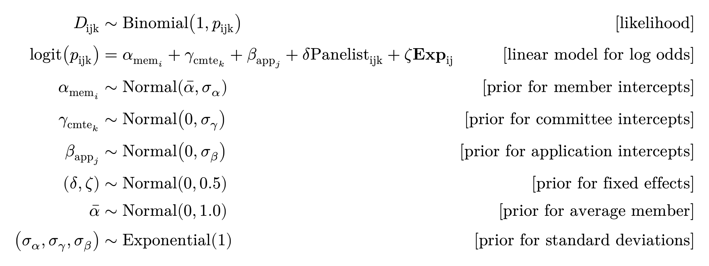

```{r setup, include=FALSE}
library(here)
library(tidyverse)
library(modelsummary)
library(tinytable)
library(patchwork)
library(marginaleffects)
knitr::opts_chunk$set(message = FALSE, warning = FALSE)
```

# Overview

This is a design and validation exercise for a project that aims to
assess how reviewer engagement and expertise may affect post-discussion
grant scores during CIHR peer review. Given the restrictive nature of
CIHR funding data, this document lays out the data-generating process we
believe is similar to CIHR's Project Grant peer review, the model we
intend to fit against it, and evidence that the models we will use can
actually recover simulated effects.

It is not a full pre-analysis plan (no pre-specified hypotheses), but
it's close in spirit, and a subsequent revision could become one.

## Research aims

1.  **Aim 1** -- How do reviewer expertise (self-described:
    high/medium/low/not enough) and engagement (assigned reviewer vs.
    non-reviewing panelist) affect the impact of panel discussion on
    scores?
2.  **Aim 2** -- Do these effects differ by applicant characteristics,
    namely gender or career stage?
3.  **Aim 3** (exploratory) -- How would alternative funding-decision
    schemes (e.g. reweighting by engagement, partial randomization near
    the funding threshold) compare to the status quo?

## Project Scheme review process

- The 3 assigned reviewers read the application and score it. At the
  meeting (and *before* any discussion), they are required to agree on a
  **consensus score**.
- After discussion all panel members (including the 3 reviewers) submit
  a **final score**. Reviewers are not bound to their own consensus
  number; they can move too.
- The final score must fall within **±0.5** of the consensus score, and
  is entered to **one decimal place**.
- The (equally weighted) average of final scores across all panel
  members feeds the funding decision.

## Data structure

We're assuming a three-level structure: CIHR-established committees,
applications nested in committees, and panel members nested in
committees (crossed with applications, since each member reviews many
applications within a cycle). Based on recent Project Grant committee
sizes (cite webpage?), our working numbers are roughly 50 committees,
but we allow the number of applications across committees to vary based
on CIHR documentation, and simulate the number of applications
proportionally (with some variance)

CIHR's Funding Analytics Team confirmed by email (2025-12-04) which
fields are actually extractable for a data pull, versus fields that can
only ever be touched by a CIHR analyst running our code in-house on the
real data (full table and follow-up questions in
`code/ror-research-log.qmd`). Headline for this document:
committee/application/member identifiers, role (reviewer vs. panelist),
self-described expertise, initial reviewer scores, consensus score,
final scores, and funding result are all extractable. **Applicant gender
and career stage -- Aim 2's entire basis -- are not**, and won't appear
even in CIHR's own distribution-matched dummy data. That constraint is
why this document exists: the simulation below is the only rehearsal Aim
2's code gets before it runs once, unsupervised, on real data.

# Modeling Strategy

## Primary outcome(s)

The primary Aim 1 outlined above is to assess how *changes* from the
initial consensus score to the final review scores (after discussion)
may vary with panel expertise and engagement. Thus, rather than our
primary outcome being the overall application score, we specifically
want to model the difference between the consensus score and the final
scores.

Let $d_{ijk}$ be the final score minus the consensus score, for the
$i$th panel member on the $j$th application in the $k$th committee:

$$d_{ijk} = \text{final score}_{ijk} - \text{consensus score}_{jk}$$

Our interest is in modeling $d_{ijk}$ directly, rather than modeling the
final score with consensus score as a covariate, for three reasons:

1.  **Point mass at zero.** We hypothesize that most or many members
    will go with the consensus score, which leads to a probability mass
    either at the consensus (if you modeled the score) or a mass at zero
    if you model the difference. A member who doesn't move from
    consensus has $d_{ijk}=0$ regardless of which application they're
    scoring. So even if you model the final score conditional on the
    consensus you will still have a spike, just relocated to wherever a
    given application's consensus happened to land. Differencing
    standardizes the spike's location (at zero) across every application
    and makes a shared two-part model more feasible.
2.  **Avoids some sources of confounding.** The consensus score is
    constant across everyone in the committee and reflects both the
    reviewer's and the application's initial "true quality" signal.
    Subtracting it off removes anything that's shared by every member
    evaluating the same application (committee identity, application
    quality, etc.), leaving only the within-application variation across
    panel members as what's left to explain. If some committees have
    both higher consensus scores and a different mix of reviewer
    expertise then consensus and 'expertise' are correlated across
    applications. Differencing eliminates this potential bias since the
    coefficient on consensus isn't estimated at all.
3.  **Matches the actual research question.** Aim 1 is about the *change
    from consensus* induced by discussion, not the *level* of the final
    score (driven mostly by application quality). Since it is simple to
    recover the final score like
    $\text{final score} = \text{consensus} + d_{ijk}$, anything Aim 3
    needs at the score level for funding-decision simulations can be
    reconstructed downstream.

## Estimand of interest

Our main quantity of interest in this project is the value that a given
committee member's score differential from the consensus ($d_{ijk}$)
would take if a particular reviewer characteristic (role or experience)
were set to a specific value, averaged over the entire population of
panel members, applications, and committees. We can write an example of,
say, the difference between differential scores for a given
member-application pairing if that member were assigned to be a panelist
or a reviewer:

::: {.content-visible when-format="html"}
$$\underbrace{\frac{1}{IJK}\sum^{K}_{k=1}\sum^{J}_{j=1}\sum^{I}_{i=1}}_{\substack{\text{Mean over members } i\text{,} \\ \text{applications } j\text{,} \\ \text{and committees } k}} \underbrace{\left(d_{ijk}(1) - d_{ijk}(0)\right)\vphantom{\sum^{K}_{k=1}\sum^{J}_{j=1}\sum^{I}_{i=1}}}_{\substack{\text{Score if assigned} \\ \text{to panelist(1)} \\ \text{or reviewer(0)}}}$$
:::

::: {.content-visible when-format="docx"}
$$\underbrace{\frac{1}{IJK}\sum^{K}_{k=1}\sum^{J}_{j=1}\sum^{I}_{i=1}}_{\substack{\text{Mean over members } i\text{,} \\ \text{applications } j\text{,} \\ \text{and committees } k}} \underbrace{\left(d_{ijk}(1) - d_{ijk}(0)\right)}_{\substack{\text{Score if assigned} \\ \text{to panelist(1)} \\ \text{or reviewer(0)}}}$$
:::

::: {.content-visible when-format="typst"}
```{=typst}
#let phantom_tall = box(width: 0pt, hide[$1 / (I J K) sum_(k=1)^K sum_(j=1)^J sum_(i=1)^I$])
$ underbrace(1 / (I J K) sum_(k=1)^K sum_(j=1)^J sum_(i=1)^I,
upright("Mean over members") i upright(",") \
upright("applications") j upright(",") \
upright("and committees") k) underbrace(#stack(dir: ltr, phantom_tall, $(d_(i j k) (1) - d_(i j k) (0))$), upright("Score if assigned") \
upright("to panelist(1)") \
upright("or reviewer(0)")) $
```
:::

Leaving aside for the moment the assumptions needed to credibly estimate
this quantity, the specific data generating process for score deviations
leads to challenges, since the distribution of this outcome depends on
two processes: 1) whether a given member deviates from the consensus
score; and 2) how large that deviation might be. Estimating these
effects across the whole population of applications leads to the
intuition for a two-part model.

## Two-part model

We expect $d_{ijk}$ to have a spike at exactly zero (members who simply
adopt the consensus score) plus variation among those who depart from
it. So the outcome is split into two linked models:

1.  **Did this member deviate at all?** A binary/logistic model on
    $1[d_{ijk} \neq 0]$.
2.  **If they deviated, by how much?** A model for the (signed)
    magnitude, conditional on deviating.

Estimating the expected value of the both parts across the entire
population of reviewers (not just those that deviate from consensus)
recovers the effect in the entire sample. This is akin to a 'hurdle'
type model [@mullahy1986] that combines a binary outcome and a magnitude
estimate for non-zero outcomes.

$$E[d_{ijk}] = \underbrace{P(\text{deviate})}_{\substack{\text{Part 1: any} \\ \text{deviation at all}}}
\times
\underbrace{E[\text{magnitude} \mid \text{deviate}]}_{\substack{\text{Part 2: size} \\ \text{given deviation}}}$$

## Model specification (Aim 1)

We adopt a Bayesian modeling approach and model the binomial outcome of
whether or not a member deviated as a function of their engagement with
the application (reviewer vs. panelist) and their self-declared
expertise to review (high, medium, low, none). In our specification
below $D_{ijk}$ is 1 for those who deviated, and we include random
effects for committees ($\gamma_{cmte[k]}$), members
($\alpha_{mem[i]}$), and applications ($\beta_{app[j]}$). For the fixed
effects $\delta$ is the effect of being a panelist vs. reviewer, and
$\zeta$ captures the suite of effects for the expertise indicators
($\textbf{Exp}_{ij}$)

:::: {.content-visible when-format="html"}
::: {style="font-size: 0.8em;"}
$$\begin{array}{rclr}
D_{ijk} & \sim & \text{Binomial}(1, p_{ijk}) & \text{[likelihood]} \\
\text{logit}(p_{ijk}) & = & \alpha_{mem[i]} + \gamma_{cmte[k]} + \beta_{app[j]} + \delta\,\text{Panelist}_{ijk} + \zeta \textbf{Exp}_{ij} & \text{[linear model for log odds]} \\
 & & & \\
\alpha_{mem[i]} & \sim & \text{Normal}(\bar\alpha, \sigma_\alpha) & \text{[prior for member intercepts]} \\
\gamma_{cmte[k]} & \sim & \text{Normal}(0, \sigma_\gamma) & \text{[prior for committee intercepts]} \\
\beta_{app[j]} & \sim & \text{Normal}(0, \sigma_\beta) & \text{[prior for application intercepts]} \\
(\delta, \zeta) & \sim & \text{Normal}(0, 0.5) & \text{[prior for fixed effects]} \\
\bar\alpha & \sim & \text{Normal}(0, 1.0) & \text{[prior for average member]} \\
(\sigma_\alpha, \sigma_\gamma, \sigma_\beta) & \sim & \text{Exponential}(1) & \text{[prior for standard deviations]} \\
\end{array}$$
:::
::::

::: {.content-visible when-format="typst"}
```{=typst}
$ D_"ijk" & tilde upright("Binomial")(1, p_"ijk") &&& upright("[likelihood]") \
  upright("logit")(p_"ijk") & = alpha_"mem"_i + gamma_"cmte"_k + beta_"app"_j + delta upright("Panelist")_"ijk" + zeta bold(upright("Exp"))_"ij" &&& upright("[linear model for log odds]") \
  alpha_"mem"_i & tilde upright("Normal")(dash(alpha), sigma_alpha) &&& upright("[prior for member intercepts]") \
  gamma_"cmte"_k & tilde upright("Normal")(0, sigma_gamma) &&& upright("[prior for committee intercepts]") \
  beta_"app"_j & tilde upright("Normal")(0, sigma_beta) &&& upright("[prior for application intercepts]") \
  (delta, zeta) & tilde upright("Normal")(0, 0.5) &&& upright("[prior for fixed effects]") \
  dash(alpha) & tilde upright("Normal")(0, 1.0) &&& upright("[prior for average member]") \
  (sigma_alpha, sigma_gamma, sigma_beta) & tilde upright("Exponential")(1) &&& upright("[prior for standard deviations]") $
```
:::

::: {.content-visible when-format="docx"}
```{=html}
<!-- pandoc's docx math converter can't render multi-row aligned math
(array/aligned/matrix all fail the same way, independent of column
count or content -- confirmed by testing) -- embedding a rendered
image instead, generated from the same Typst source as the block
above. Regenerate media/eq-m1-deviate.png by hand if that source ever
changes. -->
```


:::

Bayesian models require priors on all parameters, and we generally plan
to use weakly regularizing priors that allow for a wide range of
potential effects but that are generally skeptical of effects of large
magnitude. Below we show distributions that helped frame our decision.
For the overall probability of deviating the Normal(0, 1.0) prior (green
line in top plot) provides a generally wide possibility of the
probability of deviating (95% of the probability mass is between 14% and
88% deviating), and a Normal(0, 0.5) for the beta coefficients puts 95%
of the probability mass on differences in the probability of deviating
of +/- 20 percentage points (i.e., it is quite skeptical of very large
effect sizes).

```{r}
#| echo: false
#| label: fig-prior-m1-dev
#| fig-cap: Hypothetical priors for deviation model

knitr::include_graphics(here("writing", "media", "ror-priors-m1-deviate.png"))
```

## Model specification: magnitude, given a deviation

The second part of the model asks how large a deviation occurred among
members who deviated, i.e., $M_{ijk}$ as one of 10 discrete steps
($\pm0.1 \ldots \pm0.5$) either positive or negative. Since this outcome
has fixed categories and a natural ordering (from -0.5 to + 0.5) we use
an ordinal cumulative-logit model with flexible (non-equidistant)
thresholds $\tau_c$. One difference from Part 1 is worth flagging:
because the $K-1=9$ thresholds already anchor the model's location, none
of the group-level intercepts needs to absorb a population mean the way
$\alpha_{mem[i]}$ did above -- $\gamma_{cmte[k]}$, $\alpha_{mem[i]}$,
and $\beta_{app[j]}$ are all mean-zero here. The other difference is new
as of this round of simulation work: role (reviewer vs. panelist)
doesn't just shift *where* a member's deviation tends to land
($\eta_{ijk}$), it also affects *how spread out* the deviation is
($\kappa_{ijk}$, brms's discrimination parameter for ordinal models) --
panelists show a genuinely wider distribution of deviation sizes, not
just a different average. For consistency with how $\eta_{ijk}$ is
written above, $\kappa_{ijk}$ is shown here using the same
reference-level (Reviewer) plus contrast (Panelist) convention: an
intercept $\delta_0^{disc}$ and a contrast $\delta_1^{disc}$. Unlike
$\eta_{ijk}$, though, $\kappa_{ijk}$ has no random effects or thresholds
to implicitly absorb a reference value, so it needs an explicit
intercept term of its own -- both $\delta_0^{disc}$ and
$\delta_1^{disc}$ are still freely estimated (Reviewer's own
discrimination isn't pinned at any fixed value here). The model is
actually fit in code as `disc ~ 0 + job` (each role's discrimination
estimated directly, rather than as an intercept-plus-contrast) --
algebraically equivalent to what's shown below, chosen there for direct
interpretability against `brms`'s neutral default of $\kappa=1$ for
everyone (see research log, 2026-08-27, for the full reasoning); the
reference-contrast form here is purely to keep this equation's
presentation consistent with $\eta_{ijk}$'s.

:::: {.content-visible when-format="html"}
::: {style="font-size: 0.8em;"}
$$\begin{array}{rclr}
M_{ijk} \mid D_{ijk}=1 & \sim & \text{Cumulative}(\eta_{ijk}, \kappa_{ijk}, \boldsymbol\tau) & \text{[likelihood, 10 ordered categories]} \\
P(M_{ijk} \le c) & = & \text{logit}^{-1}\big(\kappa_{ijk}(\tau_c - \eta_{ijk})\big) & \text{[cumulative-logit link]} \\
\eta_{ijk} & = & \alpha_{mem[i]} + \gamma_{cmte[k]} + \beta_{app[j]} + \delta\,\text{Panelist}_{ijk} + \zeta \textbf{Exp}_{ij} & \text{[location]} \\
\log(\kappa_{ijk}) & = & \delta_0^{disc} + \delta_1^{disc}\,\text{Panelist}_{ijk} & \text{[role-specific discrimination]} \\
 & & & \\
\alpha_{mem[i]} & \sim & \text{Normal}(0, \sigma_\alpha) & \text{[prior for member intercepts]} \\
\gamma_{cmte[k]} & \sim & \text{Normal}(0, \sigma_\gamma) & \text{[prior for committee intercepts]} \\
\beta_{app[j]} & \sim & \text{Normal}(0, \sigma_\beta) & \text{[prior for application intercepts]} \\
\tau_c & \sim & \text{Normal}(0, 1.5), \ c = 1,\ldots,9 & \text{[prior for thresholds]} \\
(\delta, \zeta) & \sim & \text{Normal}(0, 0.5) & \text{[prior for location fixed effects]} \\
(\delta_0^{disc}, \delta_1^{disc}) & \sim & \text{Normal}(0, 1) & \text{[prior for discrimination effects]} \\
(\sigma_\alpha, \sigma_\gamma, \sigma_\beta) & \sim & \text{Exponential}(1) & \text{[prior for standard deviations]} \\
\end{array}$$
:::
::::

::: {.content-visible when-format="typst"}
```{=typst}
$ M_"ijk" bar.v D_"ijk"=1 & tilde upright("Cumulative")(eta_"ijk", kappa_"ijk", bold(tau)) &&& upright("[likelihood, 10 ordered categories]") \
  P(M_"ijk" lt.eq c) & = upright("logit")^(-1)(kappa_"ijk" (tau_c - eta_"ijk")) &&& upright("[cumulative-logit link]") \
  eta_"ijk" & = alpha_"mem"_i + gamma_"cmte"_k + beta_"app"_j + delta upright("Panelist")_"ijk" + zeta bold(upright("Exp"))_"ij" &&& upright("[location]") \
  log(kappa_"ijk") & = delta_0^"disc" + delta_1^"disc" upright("Panelist")_"ijk" &&& upright("[role-specific discrimination]") \
  alpha_"mem"_i & tilde upright("Normal")(0, sigma_alpha) &&& upright("[prior for member intercepts]") \
  gamma_"cmte"_k & tilde upright("Normal")(0, sigma_gamma) &&& upright("[prior for committee intercepts]") \
  beta_"app"_j & tilde upright("Normal")(0, sigma_beta) &&& upright("[prior for application intercepts]") \
  tau_c & tilde upright("Normal")(0, 1.5), thin c = 1, dots.h, 9 &&& upright("[prior for thresholds]") \
  (delta, zeta) & tilde upright("Normal")(0, 0.5) &&& upright("[prior for location fixed effects]") \
  (delta_0^"disc", delta_1^"disc") & tilde upright("Normal")(0, 1) &&& upright("[prior for discrimination effects]") \
  (sigma_alpha, sigma_gamma, sigma_beta) & tilde upright("Exponential")(1) &&& upright("[prior for standard deviations]") $
```
:::

**Why ordinal (`cumulative()`), not categorical/multinomial?** The 10
magnitude levels aren't just index labels -- they're the literal numeric
ordering of `final_score - consensus`
($-0.5 < -0.4 < \ldots < -0.1 < 0.1 < \ldots < 0.5$), and treating them
as categorical would throw that structure away, treating "+0.3" and
"-0.4" as no more related to each other than either is to "+0.1". It
also matches the actual data-generating mechanism: this is a continuous
quantity (a truncated-normal draw) rounded to one decimal place for
recording, not 10 qualitatively distinct outcomes -- modeling a
discretized continuum with an ordinal model, rather than as unordered
categories, is the standard match for that kind of measurement. A
multinomial model would also need a full separate set of coefficients
(role, expertise, every random effect) for each of the 9 non-reference
categories -- roughly 9x the parameters of the ordinal specification,
most poorly identified given how sparse the tail categories are --
versus the ordinal model's single location parameter (and now, a
role-specific dispersion parameter) shared across all 10 categories via
the threshold structure. That matters substantively too: our actual
hypotheses ("panelists' deviations run larger on average," "panelists
show more spread") are inherently location/dispersion statements, which
only have a natural expression on an ordered scale -- a categorical
model has no notion of shift or spread at all, just 10 free-floating
probabilities from which those would have to be reconstructed post hoc.

One caveat worth flagging: treating the *full signed* scale as a single
ordered dimension is a modeling choice, not the only defensible one. It
implicitly assumes direction and magnitude of deviation share one
underlying continuum, rather than direction being a separate,
qualitatively distinct decision (up vs. down) with magnitude nested
inside it -- the latter is what the alternative three-part model
discussed elsewhere (bernoulli direction + ordinal $|\text{magnitude}|$)
would assume instead. We think the single-continuum assumption is the
more faithful match to how these scores actually arise (one continuous
departure from consensus, not "decide direction, then decide how far"),
but it is an assumption.

# Simulating

For the basic structure of the data-generating process we simulate 50
committees. Rather than fixing the number of applications and members
per committee, both now vary to reflect real committee-to-committee
heterogeneity: each committee's candidate application pool (before
streamlining) is drawn from a beta distribution bounded to CIHR's own
stated range of 20-80 applications, and committee size is *derived* from
that pool size via a workload target (roughly 5.5 applications reviewed
per member) plus lognormal noise, bounded to the real range observed in
CIHR's Fall 2025 committee rosters (8-37 members) -- reflecting that
CIHR sizes committees to manage workload given known application volume,
not an independent draw. Each application still gets exactly 3 assigned
reviewers regardless of committee size, with the remaining members
serving as non-reviewing panelists. Not every candidate application is
discussed -- CIHR's streamlining rule removes some before discussion
(below), leaving roughly 15-16 discussed applications per committee on
average, ranging from about 7 to 23 depending on the committee's own
pool size and score distribution. A consensus score is drawn per
application by averaging the 3 reviewer scores (committee- and application-level random effects only, no
member-level variation yet, since this is before any individual scoring
happens). It should be pointed out that in practice for applications that are streamlined the consensus score is always the mean of the 3 reviewer scores. However, for applications that are discussed this is not a requirement and discussion among the 3 reviewers in the meeting (as well as the discussion of prior applications) may lead to consensus scores that are not strictly the average of the 3 reviews. We do not model that somewhat messy process here, but may be able to identify how it operates with real application data.  Whether each member deviates from that consensus is a function
of their role and self-described expertise; if they deviate, the signed
magnitude is drawn from a truncated distribution (its spread now also
role-dependent -- panelists show a wider range of deviation sizes than
reviewers) and rounded to the nearest tenth, matching CIHR's
one-decimal-place scoring (with rejection sampling so a "deviated" row
can never round down to a contradictory zero).

```{r}
#| eval: false
#| label: aim1-params
#| code-summary: "code/ror-sim-deviate.R -- parameters and generative process"

# define parameters
cmte_n = 50          # number of committees

# pool_size (candidate applications per committee, before streamlining)
# varies by committee -- beta-distributed on CIHR's stated [20, 80]
# range -- and mem_n (committee size) is DERIVED from pool_size via a
# workload target, not drawn independently
pool_min = 20
pool_max = 80
target_reviews_per_member = 5.5
mem_min  = 8         # real range, from CIHR's Fall 2025 committee rosters
mem_max  = 37

b0       = 4.0    # intercept for application's true underlying quality
u0c_sd   = 0.1    # random intercept SD for committee (quality level)
u0a_sd   = 0.3    # random intercept SD for application (quality level)

# signed magnitude of deviation, given deviation occurs, truncated to
# +/- 0.5 (CIHR's stated bound on final vs. consensus score) -- spread
# is now role-dependent, not a single shared value
dev_sd_reviewer = 0.15
dev_sd_panelist = 0.30
dev_min  = -0.5
dev_max  =  0.5

# ... committee/application/member structure (including the pool_size
# -> mem_n derivation), reviewer assignment, and expertise assignment
# omitted here -- see code/ror-sim-deviate.R for the complete script

data <- data |>
  mutate(
    p_dev = plogis(a0 + (a1 * panelist) + (a2 * exp_med) +
      (a3 * exp_low) + (a4 * exp_none)),
    deviated = rbinom(n(), 1, p_dev),
    dev_sd_i = if_else(panelist == 1, dev_sd_panelist, dev_sd_reviewer),
    deviation = if_else(
      deviated == 1,
      round_tenth(rtruncnorm(n(), a = dev_min, b = dev_max,
        mean = dev_bias + u0m_bias, sd = dev_sd_i)),
      0)
  )
```

Every parameter above is at this point just an educated guess and a
placeholder, since the point of the simulation is to see whether our
modeling approach recovers a known effects, not predictive of what
CIHR's actual numbers will look like.

## Simulated data

```{r}
#| echo: false
#| label: cmte-summary-setup

d <- read_csv(here("data", "sim-deviate.csv"), show_col_types = FALSE)

cmte_pool <- readRDS(here("output", "cmte-pool.rds"))

cmte_summary <- d |>
  group_by(cmte) |>
  summarise(n_discussed = n_distinct(app), n_members = n_distinct(memno)) |>
  left_join(cmte_pool |> select(cmte, pool_size), by = "cmte") |>
  mutate(frac_discussed = n_discussed / pool_size)

frac_range <- range(cmte_summary$frac_discussed)
```

What did we generate with the parameters above? @fig-cmte shows our
simulated `r n_distinct(cmte_summary$cmte)` committees with varying
sizes and the number of total and discussed applications. Across the
committees the fraction discussed varies from
`r sprintf("%.1f%%", 100 * frac_range[1])` to
`r sprintf("%.1f%%", 100 * frac_range[2])`. Generally, larger committees
end up with more total and more discussed applications.

```{r}
#| echo: false
#| label: fig-cmte
#| fig-cap: Distribution of committee sizes, total and discussed applications

cmte_summary |>
  ggplot(aes(x = reorder(cmte, n_members))) +
  geom_col(aes(y = n_members, fill = "Members"), width = 0.6) +
  geom_linerange(aes(ymin = n_discussed, ymax = pool_size),
                 color = "grey40", linewidth = 0.4) +
  geom_point(aes(y = pool_size, color = "Total applications"), size = 1.8) +
  geom_point(aes(y = n_discussed, color = "Discussed applications"), size = 1.8) +
  scale_fill_manual(values = c("Members" = "grey85")) +
  scale_color_manual(values = c(
    "Total applications"     = "darkorange",
    "Discussed applications" = "steelblue")) +
  scale_y_continuous(limits = c(0, 85)) +
  labs(x = "Committee", y = "Count", fill = NULL, color = NULL,
       title = "Members (bar) with total vs. discussed applications (dots)") +
  theme_minimal() +
  theme(
    legend.position = "inside",
    legend.position.inside = c(0.5, 0.90),
    legend.direction = "horizontal",
    legend.box = "horizontal",
    legend.background = element_rect(fill = "white", color = NA),
    axis.text.x  = element_blank(),
    axis.ticks.x = element_blank(),
    panel.grid.major.x = element_blank(),
    panel.grid.minor.x = element_blank()
  )
```

@fig-scores shows the distribution of initial scores from the three
reviewers, the consensus score and then a distribution of overall scores
allowing for +/- 0.5 point deviations. Since the likely true consensus
scores are not necessarily an average of the 3 reviewer scores
(depending on calibration, etc.) we see a small excess in the left tail
near 3.5. In practice a consensus score of 3.5 *among discussed
applications* is likely more rare, but this seems a reasonable
approximation.

```{r}
#| echo: false
#| label: fig-scores
#| fig-cap: Distribution of simulated intial, consensus, and overall scores 

d <- read_csv(here("data", "sim-deviate.csv"))

init_hist <- ggplot(d, aes(x = init_score)) +
  geom_histogram(binwidth = 0.1, 
  center = 0, color = "white", fill = "#377eb8") + 
  scale_x_continuous(limits = c(2.5, 5.0), 
  breaks = seq(2.5, 5.0, 0.5)) +
  labs(x = "Initial scores") + theme_classic()

consensus_hist <- ggplot(d, aes(x = consensus)) +
  geom_histogram(binwidth = 0.1, 
  center = 0, color = "white", fill = "#377eb8") + 
  scale_x_continuous(limits = c(2.5, 5.0), 
  breaks = seq(2.5, 5.0, 0.5)) + 
  labs(x = "Consensus scores") + theme_classic()

score_hist <- ggplot(d, aes(x = score)) +
  geom_histogram(binwidth = 0.1, 
  center = 0, color = "white", fill = "#377eb8") +
  scale_x_continuous(limits = c(2.5, 5.0), 
  breaks = seq(2.5, 5.0, 0.5)) +
  labs(x = "Overall scores") + theme_classic()

init_hist / consensus_hist / score_hist
```

@fig-dev also shows the odd distribution of deviations from the overall
consensus score, with a large spike at zero (roughly 2/3rds of committee
members going with the consensus):

```{r}
#| echo: false
#| label: fig-dev
#| fig-cap: Distribution of deviations from overall consensus scores

ggplot(d, aes(x = deviation)) + 
  geom_histogram(binwidth = 0.1, center = 0, 
  color = "white", fill = "#377eb8") +
  scale_x_continuous(limits = c(-0.5, 0.5),
    breaks = seq(-0.5, 0.5, 0.1)) +
  labs(x = "Deviation from consensus score") +
  theme_classic()
```

@fig-var shows how our initial simulation incorporates a small degree of
variation across committees in the overall scores, as well as the
average variation within committees across applications. For the
application-level variation we average over committee by
within-committee application rank.

```{r}
#| echo: false
#| label: fig-var
#| fig-cap: Distribution of score variation by committee and application

by_cmte <- ggplot(d, aes(x = cmte, y = score)) + 
  geom_boxplot(fill = "#377eb8") + 
  labs(x = "Committee", y = "Score") + 
  scale_x_discrete(breaks = c(10,20,30,40,50)) + 
  theme_classic()

app_ranks <- d |>
    distinct(cmte, app, consensus) |>
    group_by(cmte) |>
    mutate(consensus_rank = rank(consensus, 
    ties.method = "first")) |>
    ungroup() |>
    select(cmte, app, consensus_rank)

app_summary <- d |> left_join(app_ranks, by = c("cmte", "app"))

by_app <- ggplot(app_summary, 
  aes(x = factor(consensus_rank), y = score)) + 
  geom_boxplot(fill = "#377eb8") + 
  labs(x = "Consensus rank within committee", y = "Score") + 
  scale_x_discrete(breaks = c(5,10,15,20,25)) + 
  theme_classic()

by_cmte / by_app
```

## Part 1: did this member deviate?

```{r aim1-m1}
#| eval: false
#| code-summary: "code/ror-analysis-deviate-model.R -- Part 1 (bernoulli)"

m1_deviate <-
  brm(data = d1,
      family = bernoulli(),
      deviated ~ 1 + job + exp + (1 | cmte) + (1 | cid) + (1 | app),
      prior = c(prior(normal(0, 1.0), class = Intercept),
                prior(normal(0, 0.5), class = b),
                prior(exponential(1), class = sd)),
      iter = 2000, warmup = 1000, chains = 4, cores = 4,
      sample_prior = "yes",
      control = list(adapt_delta = 0.95))
```

Random intercepts for committee, member (`cid`), and application; fixed
effects for role and expertise. Weakly informative priors throughout --
`normal(0, 1.5)` on the (logit-scale) intercept, `normal(0, 0.5)` on
coefficients, `exponential(1)` on group-level SDs.
`sample_prior = "yes"` so we always have prior-predictive draws to check
against before trusting the posterior.

This model run on the simulated data gives the following estimates,
shown in @tbl-m1-deviate:

```{r}
#| echo: false
#| label: tbl-m1-deviate
#| fig-cap: Estimates from deviation model

tab <- readRDS(here("output", "m1-deviate-table.rds"))

fixed_start  <- which(tab$group == "Fixed effects")[1]
random_start <- which(tab$group == "Random effects (SD)")[1]

tab |>
  mutate(truth = if_else(
    group == "Random effects (SD)", "", truth)) |>
  select(term, truth, estimate, mad, conf.low, conf.high) |>
  setNames(c("Parameter", "Truth", "Estimate", "Error",
             "95% CrI Lower", "95% CrI Upper")) |>
  tt(caption = "Posterior estimates: m1_deviate") |>
  group_tt(i = list("Fixed effects (log odds)" = fixed_start,
                    "Random effects (SD)" = random_start)) |>
  style_tt(i = c(1,7), italic = TRUE) |>
  style_tt(i = 0, align = "l") |>
  style_tt(j = 1, align = "l")
```

From the fixed effects we see that we generally recover the simulated
parameters -- the 'true' treatment effects in the first column are well
approximated by our model. The three random-effect SDs are small and
estimated with considerable uncertainty; the simulated data-generating
process for whether a member deviates (`deviated`) depends only on `job`
and `exp`, with no committee-, application-, or member-level
heterogeneity built in at that stage (member-level heterogeneity only
enters the *magnitude* of deviation, modeled separately in Part 2
below), so this is the expected pattern. We can also generate the
estimated absolute probabilities of deviating and how those are affected
by `job` and `expertise` using the `marginaleffects` package.

```{r}
#| echo: false
#| label: tbl-dev-me
#| fig-cap: Marginal effects from deviation model

pred_tab <- readRDS(here("output", "m1-deviate-me.rds"))

# overall
odp <- pred_tab$estimate[pred_tab$term == "All members"] |> as.numeric()

group_starts <- which(!duplicated(pred_tab$group))
header_rows  <- group_starts + seq_along(group_starts) - 1

pred_tab |>
  select(term, estimate, conf.low, conf.high) |>
  setNames(c("Parameter", "P(deviate)",
    "95% CI Lower", "95% CI Upper")) |>
  tt(caption = "Predicted probability of deviation from consensus") |>
  group_tt(i = setNames(as.list(group_starts), unique(pred_tab$group))) |>
  style_tt(i = header_rows, italic = TRUE) |>
  style_tt(i = 0, align = "l") |>
  style_tt(j = 1, align = "l")
```

@tbl-dev-me show that the overall fraction of members that deviate is
around `r round(odp*100, 0)`%. Reviewers are slightly less likely to
deviate than non-reviewing panelists. With respect to expertise, those
with high expertise are the least likely to deviate from the consensus
(30%), whereas those with no . In practice we

## Part 2: how large, given a deviation?

CIHR scores are entered to one decimal place, so a deviator's score can
only land on one of 10 discrete steps ($\pm0.1 \ldots \pm0.5$ relative
to consensus). That's genuinely ordinal/discrete data, not a continuous
quantity with occasional extreme values -- a continuous family
(`student()`/`gaussian()`) would assign probability to impossible values
and has no natural bound at $\pm0.5$ without truncation hacks. We use an
ordinal `cumulative()` model instead, with flexible (non-equidistant)
thresholds, since there's no reason to assume the 10 steps are equally
likely -- and in the simulated data they clearly aren't (concentrated
near $\pm0.1$, sparse at $\pm0.5$, which happen to be the swings most
relevant to Aim 3's funding-decision question).

```{r aim1-m2}
#| eval: false
#| code-summary: "code/ror-analysis-magnitude-model.R -- Part 2 (ordinal)"

m1_magnitude <-
  brm(data = d1_dev,
      family = cumulative(link = "logit", threshold = "flexible"),
      deviation ~ 1 + job + exp + (1 | cmte) + (1 | cid) + (1 | app),
      prior = c(prior(normal(0, 1.5), class = Intercept),
                prior(normal(0, 0.5), class = b),
                prior(exponential(1), class = sd)),
      iter = 2000, warmup = 1000, chains = 4, cores = 4,
      sample_prior = "yes",
      control = list(adapt_delta = 0.95))
```

The cost: $E[\text{magnitude} \mid \text{deviate}]$ from an ordinal
model is not a linear prediction -- it's a probability-weighted sum over
the 10 category values, computed per posterior draw, not read off a
default `marginaleffects` contrast. That combination step (and the
corresponding
$E[d_{ijk}] = P(\text{deviate}) \times E[\text{magnitude} \mid
\text{deviate}]$ calculation across both models) is written but not yet
implemented in code -- see Open Questions below.

```{r}
#| echo: false
#| label: tbl-m1-magnitude
#| fig-cap: Estimates from magnitude model

tab <- readRDS(here("output", "m1-magnitude-table.rds"))

threshold_start <- which(tab$group == "Thresholds")[1]
fixed_start     <- which(tab$group == "Fixed effects (location)")[1]
random_start    <- which(tab$group == "Random effects (SD)")[1]
disc_start      <- which(tab$group == "Fixed effects (dispersion)")[1]

tab |>
  mutate(truth = if_else(
    group %in% c("Thresholds", "Fixed effects (dispersion)"), "", truth)) |>
  select(term, truth, estimate, mad, conf.low, conf.high) |>
  setNames(c("Parameter", "Truth", "Estimate", "Error",
             "95% CrI Lower", "95% CrI Upper")) |>
  tt(caption = "Posterior estimates: m1_magnitude") |>
  group_tt(i = list("Thresholds" = threshold_start,
                    "Fixed effects, location (log-cumulative-odds)" = fixed_start,
                    "Random effects (SD)" = random_start,
                    "Fixed effects, dispersion (log-scale)" = disc_start)) |>
  style_tt(i = c(1, 11, 16, 20), italic = TRUE) |>
  style_tt(i = 0, align = "l") |>
  style_tt(j = 1, align = "l")
```

Below you can see the average marginal predictions for reviewers vs.
panelists in terms of deviations from the consensus score, given that a
deviation occurred:

```{r}
#| echo: false
#| label: fig-m2-magnitude-job
#| fig-cap: Predicted magnitude of deviation, by role

m2j <- readRDS(here("output", "m2-magnitude-job-me.rds"))

m2j |> filter(job != "difference") |> 
  mutate(dev_val = as.numeric(as.character(group)),
  job = factor(job, levels = c("reviewer", "panelist"),
    labels = c("Reviewer", "Panelist"))) |>  
  ggplot(aes(x = dev_val, y = estimate, fill = job)) +
  geom_col(position = position_dodge(width = 0.08), 
    width = 0.08, color = "white") +
  geom_errorbar(aes(ymin = conf.low, ymax = conf.high),
    position = position_dodge(width = 0.08), width = 0.02,
    color = "grey30", linewidth = 0.3) +
  geom_vline(xintercept = 0, linetype = "dashed", 
    color = "grey50", linewidth = 0.3) +
  scale_x_continuous(breaks = seq(-0.5, 0.5, 0.1)) +
  scale_fill_manual(values = c("Reviewer" = "#377eb8", "Panelist" = "#e41a1c")) +
  labs(x = "Deviation from consensus",
       y = "Predicted probability", fill = NULL) +
  theme_classic() +
  theme(legend.position = "top")
```

These differences in predicted probabilities for deviations of different
magnitudes can also be expressed as marginal effects in @fig-m2-diffs:

```{r}
#| echo: false
#| label: fig-m2-diffs
#| fig-cap: Marginal effects of job on the magnitude of deviations

m2j <- readRDS(here("output", "m2-magnitude-job-me.rds"))

m2j |> filter(job == "difference") |> 
  mutate(dev_val = as.numeric(as.character(group))) |>
  ggplot(aes(x = dev_val, y = estimate, fill = job)) +
  geom_col(position = position_dodge(width = 0.08), 
    width = 0.08, color = "white", fill = "#4DAF4AFF") +
  geom_errorbar(aes(ymin = conf.low, ymax = conf.high),
    position = position_dodge(width = 0.08), width = 0.02,
    color = "grey30", linewidth = 0.3) +
  geom_vline(xintercept = 0, linetype = "dashed", 
    color = "grey50", linewidth = 0.3) +
  scale_x_continuous(breaks = seq(-0.5, 0.5, 0.1)) +
  labs(x = "Deviation from consensus",
       y = "Panelist - Reviewer difference", fill = NULL) +
  theme_classic() +
  theme(legend.position = "top")
```

## Software

Bayesian throughout, via `brms` + `cmdstanr` (Stan backend), matching
the conventions in our other multilevel work. `marginaleffects` for
posterior contrasts; models cached to `code/fits/` and deliberately
re-fit (not silently reused) whenever formula or data change.

# Extending to Aim 2: applicant characteristics

Since applicant gender and career stage will never be extractable -- not
even as CIHR's own dummy data -- this simulation is the only
pre-deployment test that code touching those variables gets. We added
them as **application-level** attributes (one value per application,
like consensus score, not per member) to a new, separate simulation
script (`code/ror-sim-aim2.R`) rather than growing the Aim 1 script
further -- see "A note on simulation architecture" below.

Critically, we didn't just add *main* effects of gender/career stage.
Aim 2's actual question is whether the *engagement/expertise effect on
deviation* differs by applicant characteristic -- which requires an
**interaction** term to exist in the generating process, or there's
nothing for the fitted model to recover.

```{r aim2-params}
#| eval: false
#| code-summary: "code/ror-sim-aim2.R -- applicant-level additions"

# applicant-level main effects (modest -- not the effects of interest)
g1       =  0.1   # applicant gender = female
c1       = -0.1   # applicant career stage = early

# Aim 2's actual target: does the reviewer-engagement / expertise effect
# on P(deviate) differ by applicant gender / career stage? Baked in large
# on purpose so we can confirm the two-part model machinery actually
# recovers a real interaction, not just a real main effect.
i_panelist_female     =  0.5  # job(panelist) x gender(female)
i_expnone_earlycareer =  0.6  # exp(none) x career_stage(early)

data <- data |>
  mutate(
    p_dev = plogis(a0 + (a1 * panelist) + (a2 * exp_med) +
      (a3 * exp_low) + (a4 * exp_none) +
      (g1 * female) + (c1 * early_career) +
      (i_panelist_female * panelist * female) +
      (i_expnone_earlycareer * exp_none * early_career)),
    deviated = rbinom(n(), 1, p_dev)
    # ... deviation magnitude drawn the same way as Aim 1; applicant
    # terms are deliberately left out of the magnitude part, consistent
    # with the Aim 1 finding above that signal lives in whether someone
    # deviates, not in the average size of the deviation
  )
```

**To be clear about what these numbers are and aren't:** they are chosen
to be large enough to detect cleanly in a simulation of this size, not
estimates -- or even guesses -- about the true magnitude or even
direction of any real effect in CIHR review. The goal is purely to
confirm our statistical machinery would notice an interaction if the
real data contained one.

```{r aim2-interaction-check}
#| tbl-cap: "Aim 2: interaction coefficients recovered from the simulated data (n = 18,000)"

d2 <- read_csv(here("data", "sim-aim2-data.csv"), show_col_types = FALSE)

m_aim2 <- glm(deviated ~ job * gender + exp * career_stage,
  data = d2, family = binomial())

coefs <- summary(m_aim2)$coefficients
coefs[grepl(":", rownames(coefs)), ] |>
  as_tibble(rownames = "term") |>
  tt(digits = 3)
```

Both interactions are recovered cleanly and with high significance (the
sign flips relative to the parameters above are just R's alphabetical
choice of reference category -- `job`'s reference is "panelist",
`gender`'s is "female", `career_stage`'s is "early", so e.g.
`jobreviewer:gendermale` is algebraically the same interaction as
`job(panelist):gender(female)`, just from the opposite corner of the
2x2).

**Not yet built:** Aim-2-specific versions of
`code/ror-analysis-deviate-model.R`/`ror-analysis-magnitude-model.R`
that actually include these interaction terms in the `brm()` formulas.
The simulation is ready; the model scripts that would be tested against
it aren't written yet.

# Aim 3: not yet designed

Aim 3 asks how alternative funding-decision schemes -- reweighting
scores by engagement, or partially randomizing funding decisions for
applications near the threshold -- would compare to the status quo.
That's a structurally different kind of simulation: an
intervention/counterfactual layered on top of the funding decision
itself, not just an extension of Aims 1-2's data-generating process for
reviewer behavior. We haven't started designing it, and would welcome
input on what the alternative schemes worth simulating actually are
before building anything.

Structurally, nothing in the current pipeline goes past `score` (the
final, post-discussion score) -- there's no funding-decision layer at
all yet (rank by final score, allocate against a budget, apply whatever
equalization overlay CIHR actually uses). Aim 3 can't be simulated
without adding one. This is also where the partial-randomization idea
specifically earns its keep: informally, applications near the funding
threshold can end up clustered close enough together that discussion-
driven movement alone is plausibly enough to reorder who clears the
line, which is exactly the kind of uncertainty a modified-lottery scheme
is designed to acknowledge rather than paper over with strict rank
order. Worth real data once it arrives from CIHR to confirm how tight
that clustering actually is.

# A note on simulation architecture

We're deliberately keeping a separate, self-contained simulation script
per aim (`ror-sim-deviation.R` for Aim 1, `ror-sim-aim2.R` for Aim 2,
and eventually an Aim 3 script) rather than one script that keeps
growing. Some duplication of the committee/application/member setup
across scripts is an accepted cost of each one being independently
runnable and easy to reason about in isolation.

# What this simulation validates, and what it doesn't

It validates that: (1) the two-part model structure is necessary, not
over-engineering, for this outcome; (2) the ordinal magnitude submodel
is the right match for CIHR's one-decimal-place scoring; (3) the model
can recover both main effects (Aim 1) and interaction effects (Aim 2) of
a detectable size, using only the fields CIHR has confirmed are
extractable plus the fields that would only ever be touched via an
in-house CIHR-run analysis.

It does **not** tell us anything about the true size, direction, or even
existence of any of these effects in actual CIHR peer review -- every
parameter in both simulations is an illustrative placeholder chosen for
statistical detectability, not drawn from evidence.

# Open questions

## For Arijit

- Is $d_{ijk}$ (final $-$ consensus) the right primary outcome, or is
  there a better way to frame the estimand for Aim 1/2?
- Does the interaction specification for Aim 2 (`job x gender`,
  `exp x career_stage`, both entering only the deviation-probability
  part) match how you'd operationalize the research question, or would
  you frame it differently?
- Any concerns about the priors, the random-effects structure, or the
  choice of an ordinal rather than continuous family for the magnitude
  part?
- Anything about the overall statistical strategy that looks wrong
  before this goes to CIHR?

## For CIHR's Funding Analytics Team

(Carried over from `code/ror-research-log.qmd`; repeated here since this
document is the more likely vehicle for actually sending them.)

1.  For fields that can't be extracted (applicant gender/career stage,
    reviewer gender/experience, etc.) -- can the dummy-data step still
    include *synthetic* versions of those columns for us to
    pipeline-test against, or is the in-house-run path a black box until
    the real run?
2.  Resubmission status is only available from 2023 onward -- does that
    mean our cohort has to start at the 2023 competition if we want that
    field, or can it be requested as a partially-missing covariate over
    a longer window?
3.  How should we define/measure "reviewer experience" for the fields
    where that's the blocker to a yes/no on extractability?
4.  Can you confirm our understanding of the review process itself (the
    $\pm0.5$ rule, one-decimal-place scoring, equal-weight averaging
    into the funding decision) is accurate?
5.  How much variation exists in the number of members across
    committees, applications per committee, and scores per application
    (given conflicts)?
6.  Discussion time? Do we know how long the discussion period goes at
    the application level?

# What comes next

Once the Aim 2 model script exists and `FIT_MODELS` is switched on --
after confirming CIHR's execution environment can actually compile/run
Stan via `cmdstanr`, and after prior-predictive checks on both submodels
-- this document (or its next revision) will add a results section
presenting posterior marginal effects via `marginaleffects` for both the
deviation-probability and magnitude submodels, and showing recovery of
the known simulated effects at the full posterior level, the same way
the frequentist checks above do at a point-estimate level.

# Appendix: Aim 1 simulation script (`ror-sim-deviate.R`)

The "Model specification" section above walks through a simplified,
didactic version of the Aim 1 data-generating process.
`code/ror-sim-deviate.R` is the actual, current simulation script -- the
one that produced the results reported in that section and the workhorse
we're using going forward -- and it's more procedurally involved than
the summary above lets on. Rather than re-typing or excerpting pieces of
it here (a second, hand-maintained copy that can silently drift out of
sync with the real script, a failure mode we've already hit once with
the simulation's own file names), this appendix pulls in the script's
full, current contents directly, so it can never go stale. What follows
is a guide to what to look for as you read it.

The script is organized into seven numbered sections, matching the
`##  N ...` comments in the source:

- **0-1: packages and parameters.** All parameters are illustrative
  placeholders, not estimates -- with two exceptions called out
  explicitly in the script's own comments:
  `streamline_rank_threshold = 0.60` (CIHR's stated real streamlining
  rule) and the beta-distributed committee pool size range, `[20, 80]`
  (CIHR's own stated range). `init_sd_lo` and the `exp` category mix
  were calibrated against real reviewer-score data Sam has access to,
  though that source data itself isn't reproduced or logged anywhere in
  this repository.
- **2: candidate pool.** Generates each committee's full pool of
  candidate applications (before streamlining), assigns 3 of each
  application's 24 committee members as reviewers, draws each reviewer's
  initial score, and has each reviewer separately record a
  "top"/"bottom" call -- correlated with, but not determined by, their
  score. Out-of-bounds initial scores are redrawn rather than clamped,
  to avoid an artificial probability spike at the scale's boundaries.
  The application grid is built manually (not via `faux::add_random()`)
  specifically to avoid a conflation bug found earlier in this project:
  `add_random()`'s crossed factors give identical random-effect draws to
  same-labeled applications across different committees unless a unique
  composite key (`aid`) is used instead.
- **3: streamlining decision.** Implements CIHR's actual rule as Sam
  described it from his own committee/Scientific Officer experience: an
  application is streamlined out (not discussed) if at least one
  reviewer called it "bottom" *and* its mean-of-3 score ranks in the
  bottom 60% of that committee's own candidate pool -- a relative,
  within-committee rule, not a fixed absolute score cutoff. This
  mechanism was specifically validated against two hypothetical datasets
  Sam constructed, including a case where two applications with
  identical reviewer scores had different discussed/not-discussed
  outcomes -- something a pure score-threshold rule can't produce, but
  this rank-and-call combination can. An earlier "bring back" stage,
  where a reviewer could argue to reinstate a borderline streamlined-out
  application, was tried and deliberately dropped as too haphazard and
  too thinly grounded (only \~6% of discussed applications) to be worth
  the added complexity -- see `code/ror-research-log.qmd` for that
  discussion.
- **4: the two-part deviation model.** Once discussed, each member's
  score is generated as consensus plus a two-part process: whether they
  deviate from consensus at all (a function of role and self-described
  expertise), and, if so, the signed magnitude (a truncated, rounded
  draw, with member-level leniency/harshness heterogeneity, `u0m_bias`).
  This is the same two-part structure the modeling strategy above is
  built to recover.
- **5: internal consistency checks.** A set of `stopifnot()` assertions
  -- e.g., every committee retains at least one discussed application,
  consensus never falls outside the range of its own 3 reviewer scores,
  deviation is exactly zero whenever `deviated == 0` and never zero when
  `deviated == 1`. These aren't diagnostics for a reader; they're
  guardrails that halt the script if a future edit breaks an invariant
  the rest of the design depends on.
- **6: empirical checks.** Printed summaries -- pool size and
  discussion-rate distributions, confirmation that the
  identical-scores-different-outcomes pattern the mechanism was designed
  to explain actually occurs, and a quick `glm()`/`lmer()` check that
  `job`/`exp` effects on deviation and member-level heterogeneity both
  still recover cleanly despite the richer selection stage.
- **7: output.** Writes `data/sim-deviate.csv`, which
  `code/ror-analysis-deviate-model.R` and
  `code/ror-analysis-magnitude-model.R` read.

```{r}
#| label: appendix-sim-deviate
#| file: !expr here::here("code", "ror-sim-deviate.R")
#| eval: false
#| echo: true
#| code-summary: "code/ror-sim-deviate.R -- full script"
```

# References

::: {#refs}
:::
